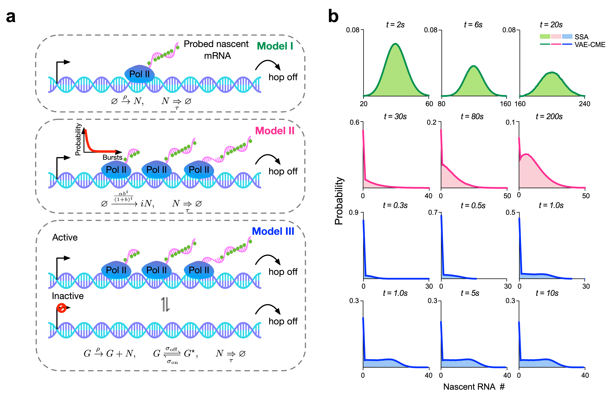
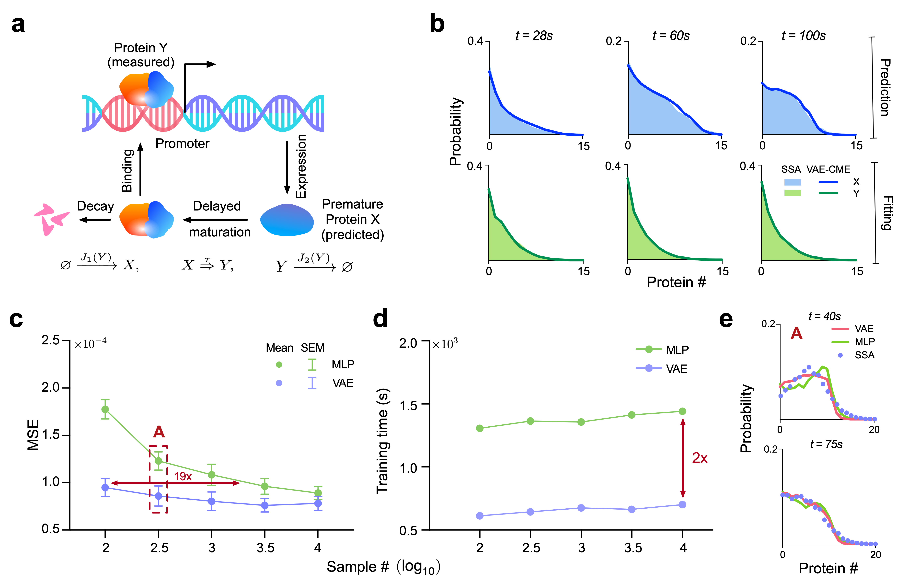
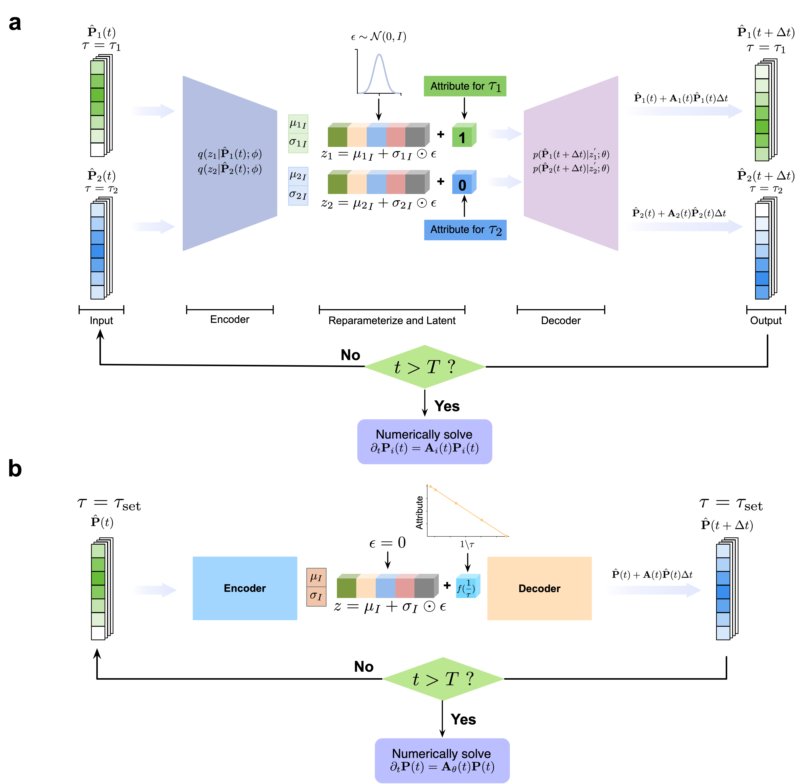

### Introduction

some introduction

### Results
#### lllustration of VAE-CME neural network structure and training protocol

#### VAE-CME accurately predicts the distributions at times unseen in the training dataset. (three models, birth death, bursty and telegraph)

#### VAE-CME accurately predicts the distributions for unobservable species. (Oscillatory circuits, less samples and less training time)

#### VAE-CME accurately predicts distributions for reaction network with different delay mechanism. (training and predicting protocol of different delay mechanism)

#### VAE-CME accurately predicts distributions for reaction network with different kinetic parameters and topology

### Discussion

<!-- prediction performance of different topology with different delay mechanism -->

在 $\tau$ 不变的情况下，用多组不同 $\rho$ 的birth death数据训练，得到的网络结构预测telegraph的双峰情况(可以)，查看是否能预测negative binomial的情况

在多组不同参数，$\tau$ 均值不变的情况下，利用Attribute对 $\tau$ 的方差进行调控，并查看是否能对telegraph的概率分布进行预测

1、先把实验做了
2、盘一下整个文章的思路，让我自己写会怎么写
3、着重看一下introduction怎么做，寻找别的文章的弱点以及我这个文章的优势
4、仔细看PNAS上那篇文章
5、图的配色看下
